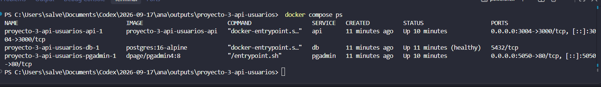
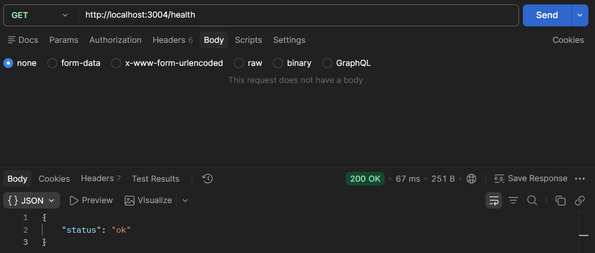
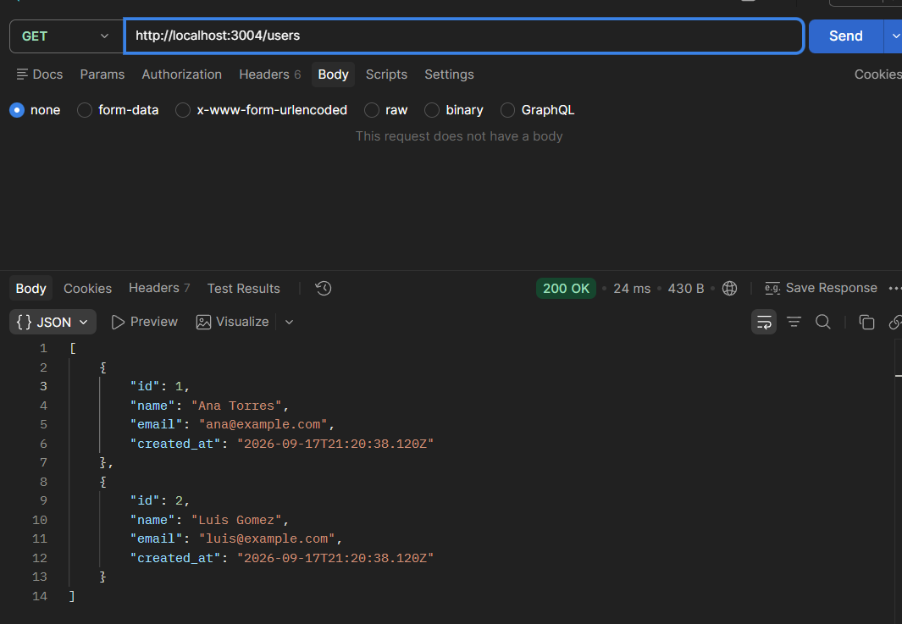
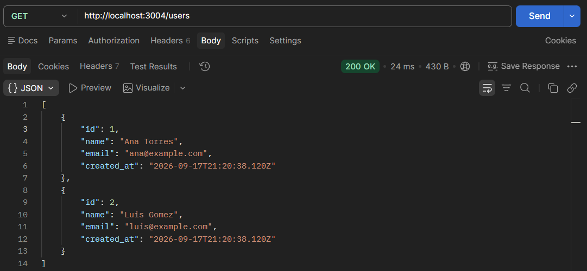
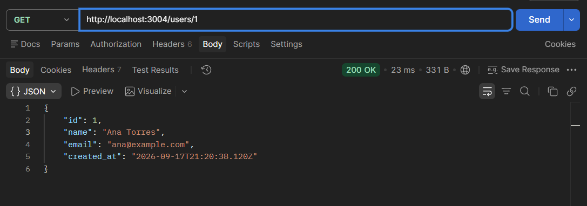
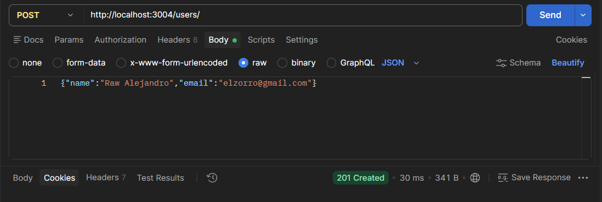
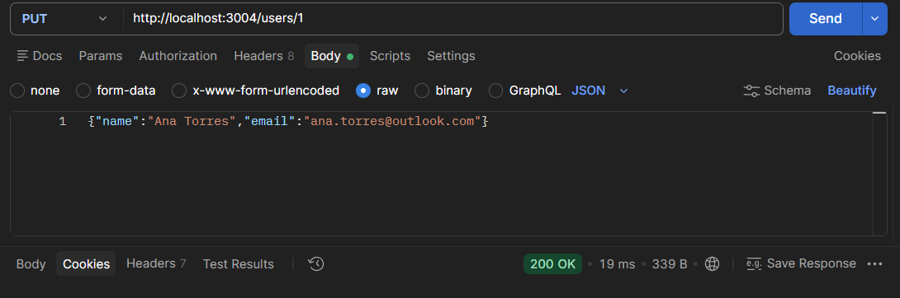
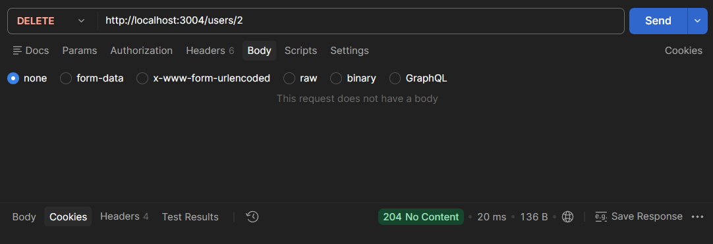
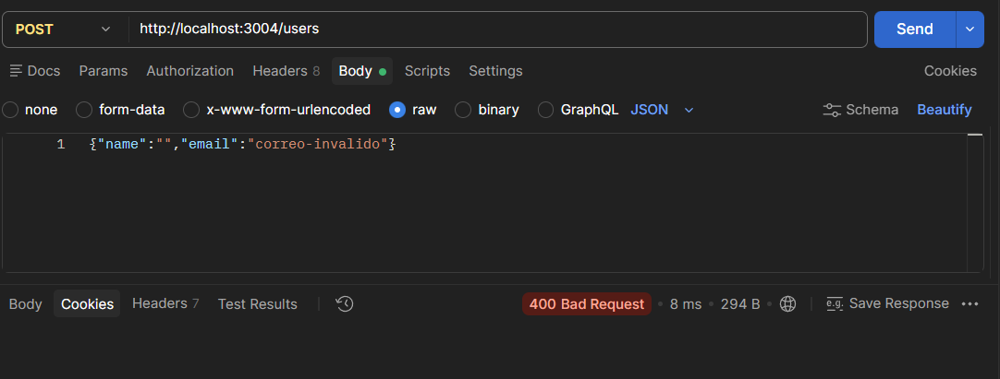

# Proyecto 3 - API de usuarios con PostgreSQL y pgAdmin

API REST de usuarios desarrollada con Node.js, Express y PostgreSQL. La solucion se ejecuta con Docker Compose e incluye una imagen propia para la API, una base de datos inicializada con SQL y pgAdmin para administrarla visualmente.

## Tecnologias

- Node.js 20 y Express
- PostgreSQL 16
- pgAdmin 4
- Docker y Docker Compose

## Servicios

| Servicio | Funcion |
| --- | --- |
| `api` | Expone el endpoint de salud y el CRUD de usuarios. Se construye desde el `Dockerfile` del proyecto. |
| `db` | Ejecuta PostgreSQL y crea la tabla `users` mediante `db/001-init.sql`. |
| `pgadmin` | Permite consultar y administrar PostgreSQL desde el navegador. |

## Configuracion

Copie las variables de ejemplo y defina contrasenas propias:

```powershell
Copy-Item .env.example .env
notepad .env
```

En esta ejecucion se utilizo `API_PORT=3004`, ya que el puerto `3000` estaba ocupado por otro contenedor. pgAdmin usa el puerto `5050`.

```env
API_PORT=3004
PGADMIN_PORT=5050
```

## Arranque

```powershell
docker compose up -d --build
docker compose ps
```

Accesos:

- API: `http://localhost:3004`
- pgAdmin: `http://localhost:5050`

Para conectar pgAdmin a la base de datos, cree un servidor con estos valores:

| Campo | Valor |
| --- | --- |
| Host name/address | `db` |
| Port | `5432` |
| Username | Valor de `POSTGRES_USER` en `.env` |
| Password | Valor de `POSTGRES_PASSWORD` en `.env` |
| Database | Valor de `POSTGRES_DB` en `.env` |

El host es `db` y no `localhost` porque pgAdmin y PostgreSQL se comunican dentro de la red de Docker Compose, que proporciona DNS por nombre de servicio.

## Endpoints

| Metodo | Ruta | Descripcion | Codigo esperado |
| --- | --- | --- | --- |
| GET | `/health` | Verifica la conexion de la API con PostgreSQL. | `200 OK` |
| GET | `/users` | Lista los usuarios. | `200 OK` |
| GET | `/users/:id` | Obtiene un usuario. | `200 OK` o `404 Not Found` |
| POST | `/users` | Crea un usuario. | `201 Created` o `400 Bad Request` |
| PUT | `/users/:id` | Actualiza un usuario. | `200 OK`, `400 Bad Request` o `404 Not Found` |
| DELETE | `/users/:id` | Elimina un usuario. | `204 No Content` o `404 Not Found` |

Todos los POST y PUT requieren `name` y `email`. El correo debe tener un formato valido; en caso contrario, la API devuelve `400 Bad Request`.

## Evidencias de funcionamiento

### Servicios activos

Los tres servicios se encuentran ejecutandose. PostgreSQL aparece en estado `healthy`, la API expone el puerto `3004` y pgAdmin el `5050`.



### Salud de la API

El endpoint `GET /health` responde con `200 OK` y el estado `ok`, lo que confirma la conectividad con la base de datos.



### Listar y consultar usuarios

La migracion inicial creo los usuarios de ejemplo Ana Torres y Luis Gomez. Se verifico el listado completo y la consulta individual del usuario `1`.







### Crear usuario

Se creo el usuario `Raw Alejandro` con el endpoint `POST /users`, que respondio con `201 Created`.



### Actualizar usuario

Se actualizo el correo de Ana Torres mediante `PUT /users/1`; la API respondio con `200 OK`.



### Eliminar usuario

Se elimino el usuario con identificador `2` mediante `DELETE /users/2`. La respuesta `204 No Content` confirma que la operacion se realizo correctamente.



### Validacion de datos

Un `POST /users` con nombre vacio y correo invalido responde con `400 Bad Request`, como requiere el enunciado.



## Migracion y persistencia

El archivo `db/001-init.sql` crea la tabla `users` y agrega datos de ejemplo. PostgreSQL ejecuta los scripts de `/docker-entrypoint-initdb.d` solo cuando crea un volumen de datos vacio por primera vez.

Para reiniciar por completo la base de datos durante desarrollo:

```powershell
docker compose down -v
docker compose up -d --build
```

El comando anterior borra los datos, por lo cual debe usarse solo cuando se quiera reconstruir la base de datos desde cero. Para detener los servicios preservando los datos, use `docker compose down`.

## Makefile

El proyecto incluye estos comandos de ayuda:

```powershell
make up      # Construye e inicia los servicios
make down    # Detiene los servicios sin eliminar volumenes
make logs    # Muestra registros en tiempo real
make ps      # Muestra el estado de los servicios
make test    # Ejecuta solicitudes de prueba
```

## Git y GitHub

El aviso `detected dubious ownership` de Git aparece cuando el propietario de la carpeta no coincide con el usuario que esta ejecutando Git. Para marcar exclusivamente esta carpeta como segura, ejecute:

```powershell
git config --global --add safe.directory "C:/Users/salve/Documents/Codex/2026-09-17/ana/outputs/proyecto-3-api-usuarios"
```

Luego puede agregar el remoto y subir los commits:

```powershell
git remote add origin https://github.com/SalveBastian/proyecto-3-api-usuarios.git
git branch -M main
git push -u origin main
```

## Preguntas de reflexion

**¿Por que la migracion se ejecuta una sola vez?** Porque el contenedor oficial de PostgreSQL solo procesa los scripts de inicializacion cuando el directorio de datos esta vacio. Para volver a ejecutarlos, cree una migracion nueva o elimine intencionalmente el volumen con `docker compose down -v`.

**¿Por que pgAdmin usa `db` y no `localhost`?** Dentro de Compose, `localhost` seria el mismo contenedor de pgAdmin. El nombre `db` apunta al contenedor de PostgreSQL mediante el DNS interno de la red.

**¿Que evita que la API inicie demasiado pronto?** El `healthcheck` de PostgreSQL usa `pg_isready`, y `depends_on` con `condition: service_healthy` hace que la API espere hasta que la base de datos este lista para recibir conexiones.
